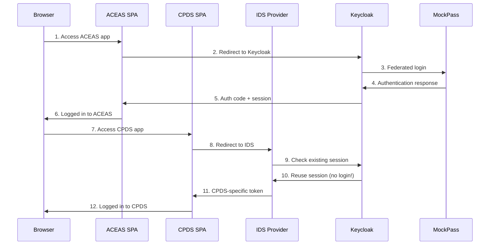

# SSO Application Stack

A comprehensive single sign-on (SSO) application stack built with Docker, featuring Keycloak, MockPass OIDC provider, and multiple microservices. This project demonstrates enterprise-grade authentication patterns with modern DevOps practices.

## 🏗️ Architecture

The stack consists of containerized services orchestrated with Docker Compose:

### Core Services
- **🔐 Keycloak** – Enterprise identity provider with custom SPIs and agency realm configuration
- **🎭 MockPass** – Singapore government authentication simulator (SingPass/CorpPass)
- **🔍 IDS** – Node.js OpenID Connect provider for token brokering
- **🌐 Nginx** – High-performance reverse proxy with SSL/TLS support
- **🗃️ PostgreSQL** – Keycloak database with optimized performance settings

### Application Services  
- **📱 ACEAS API** – Sample microservice with Keycloak integration
- **📊 CPDS API** – Sample microservice with IDS token validation
- **🖥️ Web Frontend** – Single-page applications served by Nginx

### Infrastructure Features
- 🔒 **SSL/TLS Support** – Self-signed certificates for development
- 📊 **Health Checks** – Comprehensive service monitoring
- 🎯 **Resource Limits** – Memory and CPU constraints for stability
- 🔄 **Hot Reload** – Development-friendly file watching
- 📝 **Centralized Logging** – Background log collection and viewing

## 🚀 Quick Start

### Prerequisites
- [Docker](https://docs.docker.com/get-docker/) and Docker Compose V2
- [Make](https://www.gnu.org/software/make/) (for convenience commands)
- Host entries in `/etc/hosts` (Windows: `C:\Windows\System32\drivers\etc\hosts`):
  ```
  127.0.0.1 eservice.localhost
  127.0.0.1 mockpass.localhost
  ```

### Getting Started

1. **Start the stack**
   ```bash
   make up
   ```
   Services start in background with automatic logging to `logs/compose.*.log`

2. **Check service health**
   ```bash
   make health
   ```

3. **Access applications**
   - 🌐 **Main Portal**: http://eservice.localhost
   - 🔐 **Keycloak Admin**: http://eservice.localhost/auth/admin (admin/admin)  
   - 🎭 **MockPass**: http://mockpass.localhost
   - 📱 **ACEAS App**: http://eservice.localhost/aceas/
   - 📊 **CPDS App**: http://eservice.localhost/cpds/

4. **View logs**
   ```bash
   make logs              # Live logs from all services
   make logs-file         # Background log file
   make tail-keycloak     # Last 50 lines from Keycloak
   ```

5. **Stop the stack**
   ```bash
   make down
   ```

## 🛠️ Development Commands

### Service Management
```bash
# Start/Stop
make up                 # Start all services (background)
make up-fg              # Start all services (foreground)
make up-logs            # Start services + follow logs
make down               # Stop all services
make restart            # Restart all services

# Individual Services
make re-keycloak        # Rebuild and restart Keycloak
make re-ids             # Rebuild and restart IDS
make shell-keycloak     # Open shell in Keycloak container
```

### Logging & Monitoring
```bash
# Live Logs
make logs               # All services
make log-keycloak       # Individual service logs
make log-mockpass       # MockPass logs
make log-ids            # IDS logs

# Tail Logs (last 50 lines)
make tail-keycloak      # Keycloak recent logs
make tail-db            # Database logs
make tail-web           # Nginx logs

# Background Logging
make logs-start         # Start background logging
make logs-stop          # Stop background logging
make logs-file          # View background log file
```

### Health & Diagnostics
```bash
make health             # Service health status
make status             # Container status
make monitor            # Resource usage
make nginx-test         # Test Nginx configuration
make nginx-reload       # Reload Nginx config
```

### SSL/TLS Management
```bash
make ssl-generate       # Generate self-signed certificates
make ssl-info           # View certificate information
```

### Database Operations
```bash
make db-backup          # Backup Keycloak database
make db-restore         # Restore from backup
make optimize-db        # Optimize database performance
```

### Development Environment
```bash
make dev-up             # Start with development overrides
make dev-debug-keycloak # Start Keycloak with debug (port 8787)
make dirs-create        # Create required directories
```

## 📁 Project Structure

```
app-sso/
├── 🔧 docker-compose.yml           # Main service definitions
├── 🔧 docker-compose.override.yml  # Development overrides
├── 🔧 Makefile                     # Automation commands
├── 📋 README.md                    # This file
│
├── 🔐 keycloak-custom/              # Custom Keycloak build
│   ├── 📄 Dockerfile               # Optimized Keycloak image
│   └── 🔌 spi/                     # Custom SPI extensions
│
├── 🔍 keycloak-import/              # Realm configurations
│   ├── 🌐 realm--agency-realm--export.json
│   └── 👑 realm--master--export.json
│
├── 🎭 mockpass/                     # Singapore auth simulator
│   ├── 📄 Dockerfile
│   ├── 🔧 package.json
│   └── 📚 lib/                     # MockPass libraries
│
├── 🔍 services/                     # Microservices
│   ├── 🔗 ids/                     # OIDC provider
│   ├── 📱 aceas-api/               # ACEAS backend
│   └── 📊 cpds-api/                # CPDS backend
│
├── 🌐 nginx/                        # Reverse proxy
│   ├── 📄 nginx.conf
│   ├── 🔧 common.conf
│   └── 📁 conf.d/                  # Virtual hosts
│
├── 🖥️ web/ & webroot/               # Frontend applications
├── 🔒 ssl/                          # SSL certificates
├── 📝 logs/                         # Application logs
└── 🗃️ data/                         # Persistent data
```

## 🔄 Authentication Flow

### Cross-Application SSO


### Key Benefits
- 🔄 **Single Sign-On**: Login once, access all applications
- 🎭 **Singapore Integration**: MockPass for SingPass/CorpPass simulation  
- 🔒 **Token Isolation**: Application-specific tokens via IDS
- 🏢 **Enterprise Ready**: Keycloak with custom SPIs and realm management

## 🐳 Docker Configuration

### Service Architecture
- **Networks**: Isolated networks for security (app_network, db_network)
- **Health Checks**: TCP-based monitoring for all services
- **Resource Limits**: Memory and CPU constraints
- **Volume Management**: Hybrid approach (bind mounts + Docker volumes)
- **Security**: No-new-privileges, tmpfs mounts, readonly filesystems

### Environment Support
- **Development**: Hot reload, debug ports, volume mounts
- **Production**: Optimized builds, security hardening, SSL enforcement
- **Cross-Platform**: Windows and Unix/Linux support in Makefile

## 🔧 Configuration

### Default Credentials
- **Keycloak Admin**: admin/admin
- **Demo User**: demo/demo123  
- **MockPass User**: Use any valid NRIC/FIN format

### Key Endpoints
- **Main Application**: http://eservice.localhost
- **Keycloak**: http://eservice.localhost/auth/
- **MockPass**: http://mockpass.localhost
- **Health Checks**: Individual service health endpoints
- **Debug Port**: 8787 (Keycloak debug in development)

### SSL Configuration
Self-signed certificates are generated for:
- `eservice.localhost` (main application)
- `mockpass.localhost` (MockPass service)

## 🚨 Troubleshooting

### Common Issues
```bash
# Services unhealthy
make health                    # Check service status
make logs                      # View live logs
make tail-<service>           # Check recent logs

# Keycloak SPI issues  
make re-keycloak              # Rebuild with latest SPI
docker exec kc_agency ls /opt/keycloak/providers/

# Network connectivity
make nginx-test               # Test Nginx config
make nginx-reload             # Reload configuration

# Database issues
make optimize-db              # Optimize performance
make db-backup                # Backup before changes
```

### Performance Tuning
```bash
make analyze-performance      # System performance analysis
make monitor                  # Live resource monitoring  
make optimize-db              # Database optimization
```

## 🧹 Maintenance

### Cleanup Commands
```bash
make clean                    # Clean containers and images
make cleanup                  # Comprehensive cleanup + volumes
make prune                    # Remove unused Docker resources
make dirs-clean               # Clean data directories (destructive!)
```

### Backup & Restore
```bash
make backup-all               # Backup database + Keycloak config
make restore-db BACKUP_FILE=backup/db_20231018.sql
```

## 🔒 Security Features

- 🛡️ **Hardened Containers**: Security-focused Docker configuration
- 🔐 **SSL/TLS Ready**: Self-signed certificates for development
- 🎯 **Resource Limits**: Prevent resource exhaustion
- 🔍 **Health Monitoring**: Continuous service health checks  
- 📝 **Audit Logging**: Comprehensive logging for troubleshooting
- 🚫 **Network Isolation**: Segmented networks for database access

## 📚 Additional Resources

- [Keycloak Documentation](https://www.keycloak.org/documentation)
- [MockPass Documentation](https://github.com/opengovsg/mockpass)
- [Docker Compose Reference](https://docs.docker.com/compose/)
- [Nginx Configuration Guide](https://nginx.org/en/docs/)

## 🤝 Contributing

1. Follow the existing code style and patterns
2. Test changes with `make rebuild` 
3. Update documentation for new features
4. Use `make help` to see all available commands

---

> **Note**: This is a development environment. For production deployment, review security settings, use proper SSL certificates, and configure appropriate secrets management.
