# SSO Application Stack

A learning playground for single sign-on (SSO) patterns built with Docker, featuring Keycloak, MockPass OIDC provider, MockSAML provider, and multiple microservices. This project is designed for experimentation and understanding authentication flows in a local development environment.

[](https://www.docker.com/)
[](https://www.keycloak.org/)
[](https://nodejs.org/)
[](https://nginx.org/)
[](https://www.postgresql.org/)
[](https://github.com/kristophjunge/test-saml-idp)

## Screenshots

### Main Portal Dashboard
The eServices portal provides access to both App1 and App2 applications with professional branding and modern UI.

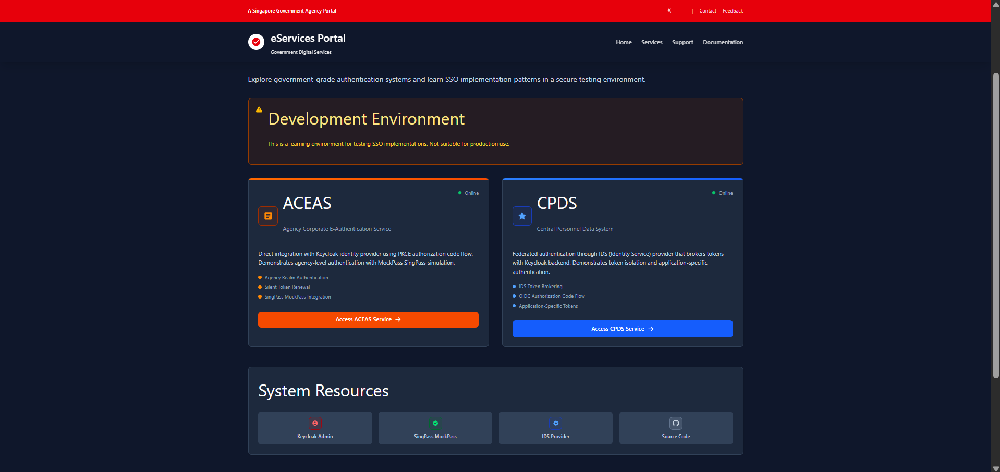

### App1 Application 
Direct Keycloak authentication with Authorization Code + PKCE flow, featuring real-time authentication status and token management.

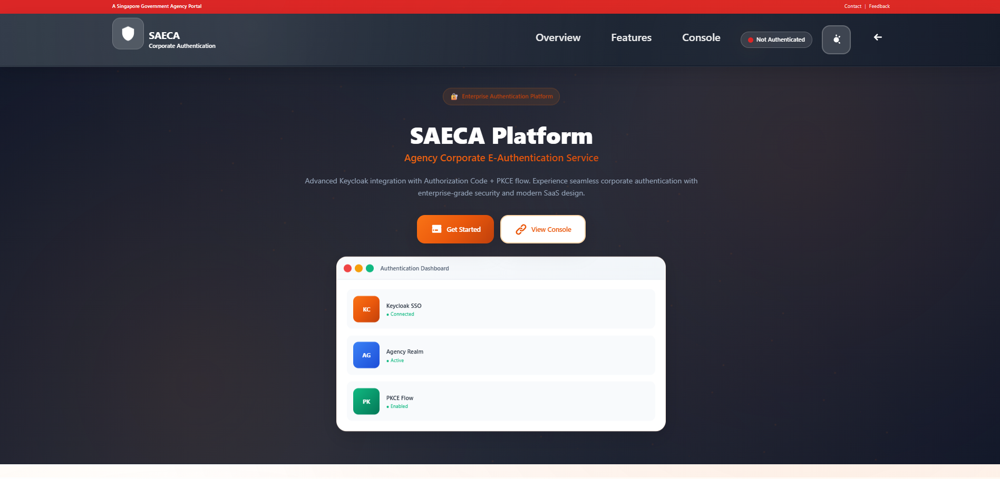
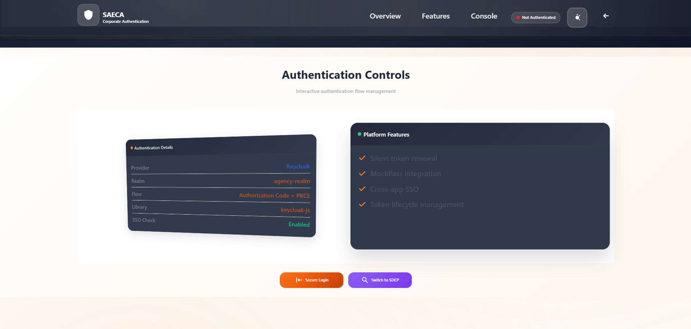
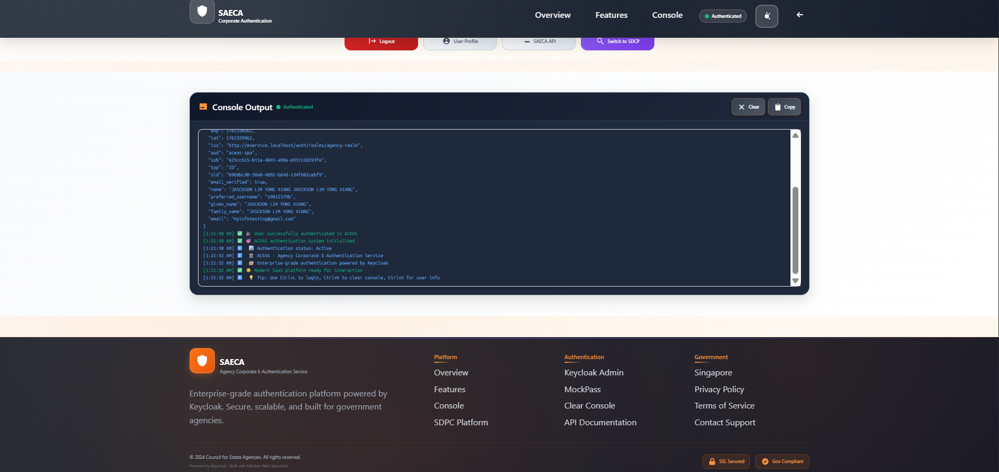

### App2 Application
Federated authentication through IDS provider that brokers tokens with Keycloak backend, demonstrating token isolation patterns.

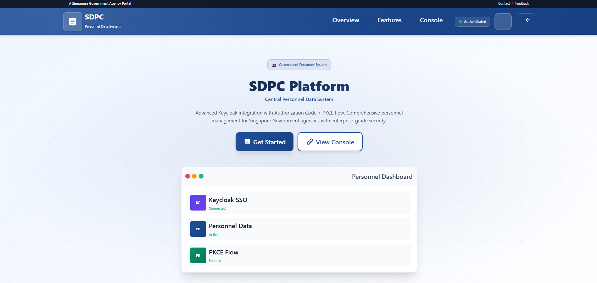
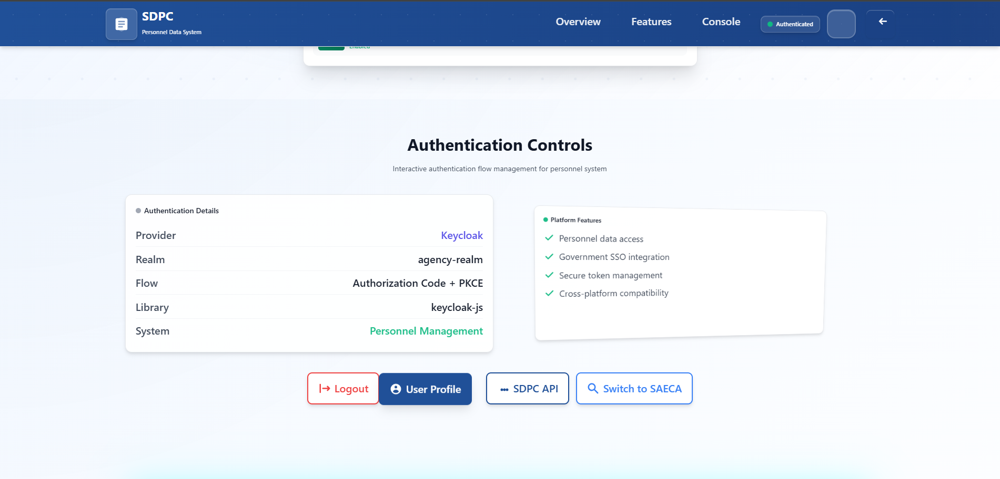
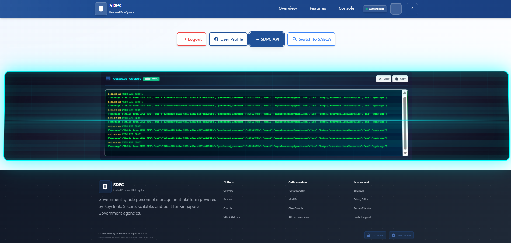

### Keycloak Login Page
Comprehensive identity management with agency realm configuration, user management, and authentication flow monitoring.

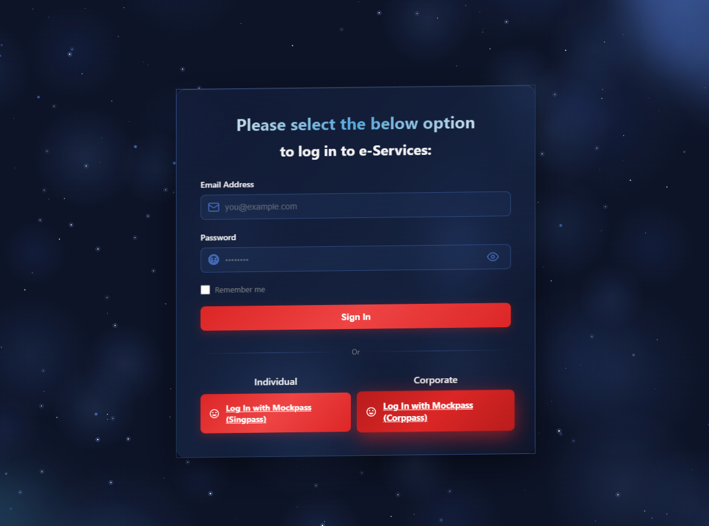
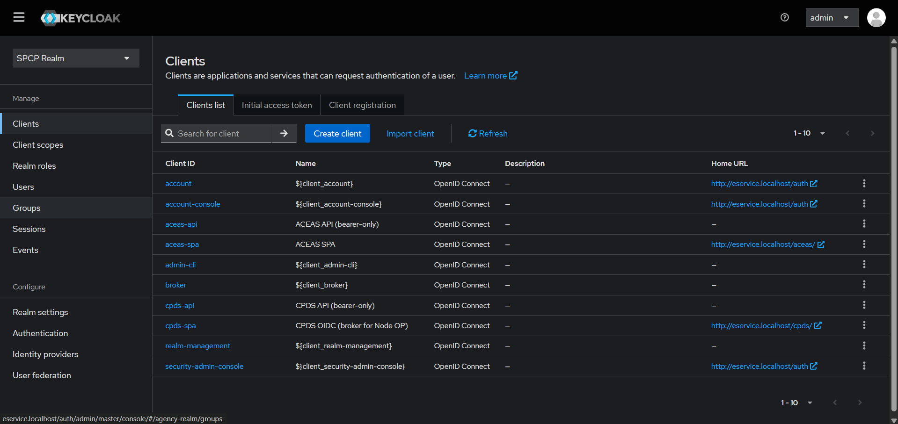

### MockPass Authentication
SingPass simulation providing realistic authentication experience for testing and development.

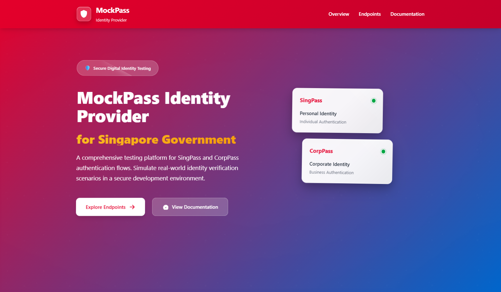
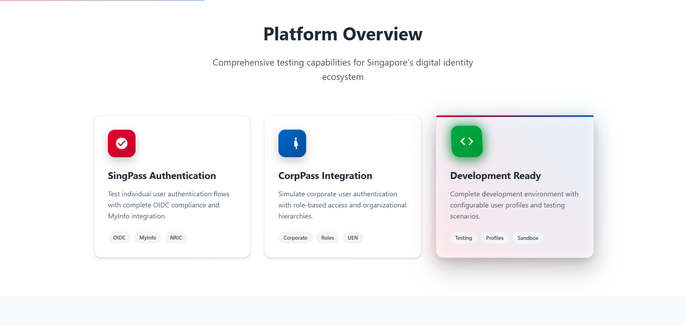
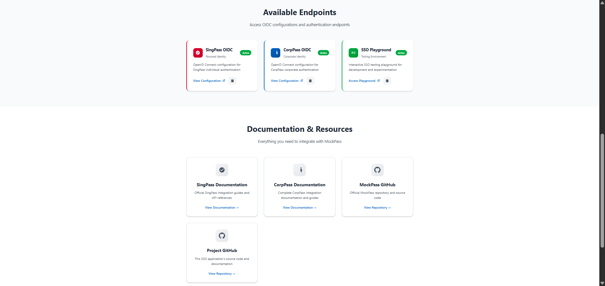
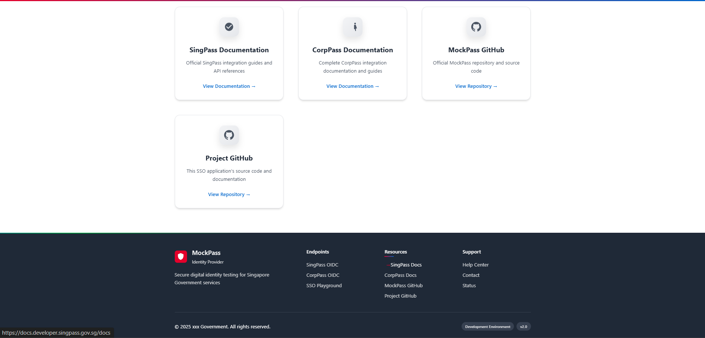
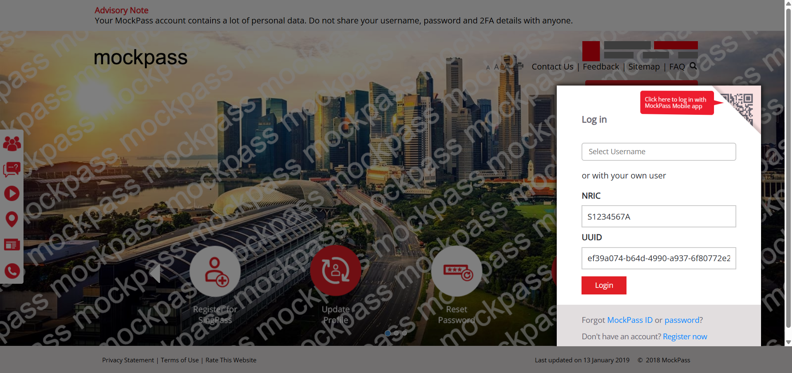

### MockSAML Authentication
Test SAML Identity Provider for simulating SAML-based authentication flows.

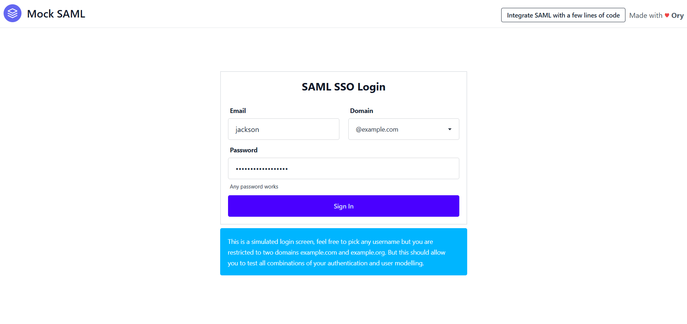
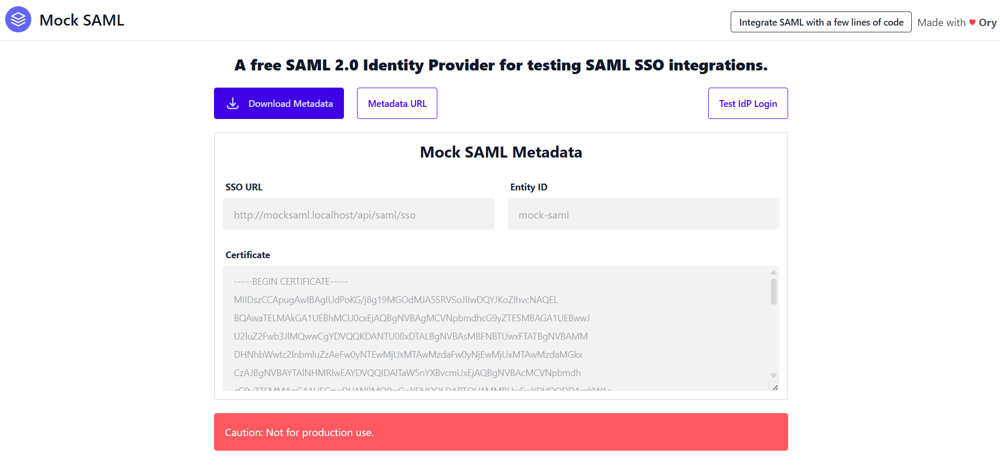

### Error Pages
Error handling with 404 and 50x pages featuring animations and auto-refresh functionality.

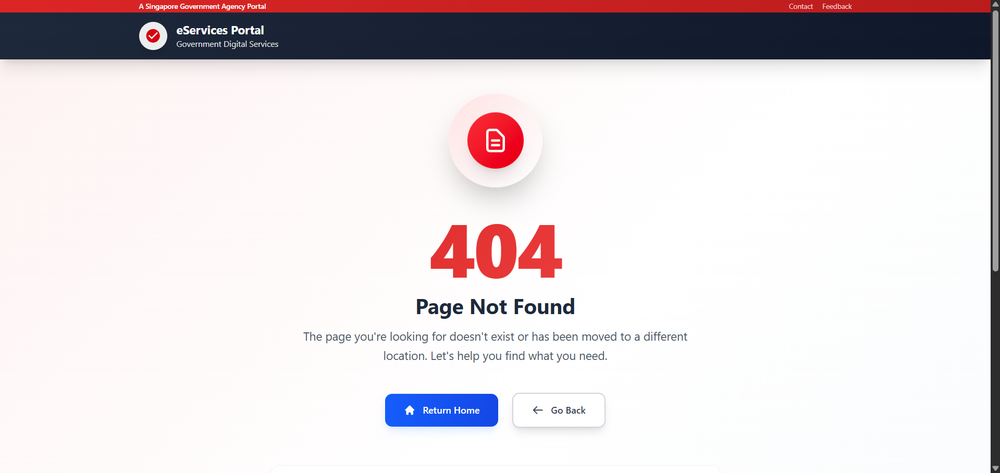
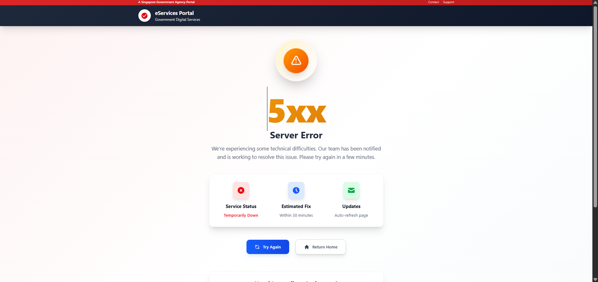

## Table of Contents

- [ Architecture](#️-architecture)
- [ Quick Start](#-quick-start)
- [ Git Submodules](#-git-submodules)
- [ Development Commands](#️-development-commands)
- [ Project Structure](#-project-structure)
- [ Authentication Flow](#-authentication-flow)
- [ Docker Configuration](#-docker-configuration)
- [ Configuration](#-configuration)
- [ Troubleshooting](#-troubleshooting)
- [ Deployment](#-deployment)
- [ Additional Resources](#-additional-resources)
- [ License](#-license)

## Architecture

The stack consists of containerized services orchestrated with Docker Compose:

### Core Services
- ** Keycloak** - Identity provider with custom SPIs and agency realm configuration
- ** MockPass** - SPCP authentication simulator (SingPass/CorpPass)
- ** MockSAML** - Test SAML Identity Provider for SAML authentication flows
- ** IDS** - Node.js OpenID Connect provider for token brokering
- ** Nginx** - High-performance reverse proxy with SSL/TLS support
- ** PostgreSQL** - Keycloak database with optimized performance settings

### Application Services  
- **App1 API** - Sample microservice with Keycloak integration
- **App2 API** - Sample microservice with IDS token validation
- **Web Frontend** - Single-page applications served by Nginx

### Infrastructure Features
- **SSL/TLS Support** - Self-signed certificates for development
- **Health Checks** - Comprehensive service monitoring
- **Resource Limits** - Memory and CPU constraints for stability
- **Hot Reload** - Development-friendly file watching
- **Centralized Logging** - Background log collection and viewing

## Quick Start

### Prerequisites
- [Docker](https://docs.docker.com/get-docker/) and Docker Compose V2
- [Make](https://www.gnu.org/software/make/) (for convenience commands)
- **Host file configuration** (see setup below)

### Git Submodules

This repository vendors its SingPass/CorpPass simulators through Git submodules so the Docker Compose stack can mount their sources locally:

- `mockpass` - SingPass/CorpPass OIDC simulator fork
- `mocksaml` - SAML identity provider fork

Clone or update the repository with submodules included:

```bash
git clone --recurse-submodules <repo-url>
# or, if you already cloned without them:
git submodule update --init --recursive
```

When pulling new changes, keep the submodules in sync with:

```bash
git pull --recurse-submodules
git submodule update --remote --merge   # follows the branches defined in .gitmodules
```

Use `git submodule status` to confirm everything is checked out, and run `git submodule sync --recursive` if the `.gitmodules` file changes (for example, when a submodule URL is updated). Missing or stale submodules will cause `make` targets and the Docker services to fail because the `mockpass` and `mocksaml` directories will be empty.

### Host File Configuration

For the application to work correctly, you need to add entries to your system's hosts file to point the required domains to localhost.

#### Windows
1. **Open Command Prompt as Administrator**
   - Press `Win + R`, type `cmd`, then press `Ctrl + Shift + Enter`

2. **Edit the hosts file**
   ```cmd
   notepad C:\Windows\System32\drivers\etc\hosts
   ```

3. **Add these lines at the end of the file**
   ```
   127.0.0.1 eservice.localhost
   127.0.0.1 mockpass.localhost
   127.0.0.1 mocksaml.localhost
   ```

4. **Save and close the file**

#### macOS
1. **Open Terminal**

2. **Edit the hosts file with your preferred editor**
   ```bash
   sudo nano /etc/hosts
   ```
   Or with vim:
   ```bash
   sudo vim /etc/hosts
   ```

3. **Add these lines at the end of the file**
   ```
   127.0.0.1 eservice.localhost
   127.0.0.1 mockpass.localhost
   127.0.0.1 mocksaml.localhost
   ```

4. **Save and exit**
   - For nano: `Ctrl + X`, then `Y`, then `Enter`
   - For vim: `:wq` then `Enter`

5. **Flush DNS cache**
   ```bash
   sudo dscacheutil -flushcache
   sudo killall -HUP mDNSResponder
   ```

#### Linux
1. **Open Terminal**

2. **Edit the hosts file**
   ```bash
   sudo nano /etc/hosts
   ```
   Or with your preferred editor:
   ```bash
   sudo vim /etc/hosts
   ```

3. **Add these lines at the end of the file**
   ```
   127.0.0.1 eservice.localhost
   127.0.0.1 mockpass.localhost
   127.0.0.1 mocksaml.localhost
   ```

4. **Save and exit**
   - For nano: `Ctrl + X`, then `Y`, then `Enter`
   - For vim: `:wq` then `Enter`

5. **Flush DNS cache** (varies by distribution)
   ```bash
   # Ubuntu/Debian
   sudo systemctl restart systemd-resolved
   
   # CentOS/RHEL/Fedora
   sudo systemctl restart NetworkManager
   
   # Or manually flush
   sudo systemctl flush-dns
   ```

#### Verify Configuration
After updating your hosts file, verify the configuration works:


```bash
# Test eservice.localhost
ping eservice.localhost

# Test mockpass.localhost  
ping mockpass.localhost
```

Both should resolve to `127.0.0.1` (localhost).

**Alternative: Using /etc/hosts managers**
- **Windows**: [HostsMan](http://www.abelhadigital.com/hostsman) or [Hosts File Editor](https://hostsfileeditor.com/)
- **macOS**: [Gas Mask](https://github.com/2ndalpha/gasmask) or [SwitchHosts](https://switchhosts.vercel.app/)
- **Linux**: [SwitchHosts](https://switchhosts.vercel.app/) (cross-platform)

### Getting Started

1. **Clone the repository**
   ```bash
   git clone https://github.com/fajarnugraha37/app-sso.git
   cd app-sso
   ```

2. **Start the stack**
   ```bash
   make up
   ```
   Services start in background with automatic logging to `logs/compose.*.log`

3. **Wait for services to be ready** (optional)
   ```bash
   make wait-healthy
   ```

4. **Check service health**
   ```bash
   make health
   ```

5. **Access applications**
   - **Main Portal**: http://eservice.localhost
   - **Keycloak Admin**: http://eservice.localhost/auth/admin (admin/admin)  
   - **MockPass**: http://mockpass.localhost
   - **MockSAML**: http://mocksaml.localhost
   - **App1**: http://eservice.localhost/aceas/
   - **App2**: http://eservice.localhost/cpds/

6. **View logs**
   ```bash
   make logs              # Live logs from all services
   make logs-file         # Background log file
   make tail-keycloak     # Last 50 lines from Keycloak
   ```

7. **Stop the stack**
   ```bash
   make down
   ```

### First-Time Setup Checklist

- [ ] Docker and Docker Compose installed
- [ ] Make command available
- [ ] Host file entries added
- [ ] Hosts resolving correctly (ping test)
- [ ] Port 80, 443, 5432, 8080 available
- [ ] At least 4GB RAM available for containers

## Development Commands

### Service Management
```bash
# Start/Stop
make up                 # Start all services (background)
make up-fg              # Start all services (foreground)
make up-logs            # Start services + follow logs
make down               # Stop all services
make restart            # Restart all services

# Individual Services
make re-keycloak        # Rebuild and restart Keycloak
make re-ids             # Rebuild and restart IDS
make shell-keycloak     # Open shell in Keycloak container
```

### Logging & Monitoring
```bash
# Live Logs
make logs               # All services
make log-keycloak       # Individual service logs
make log-mockpass       # MockPass logs
make log-ids            # IDS logs

# Tail Logs (last 50 lines)
make tail-keycloak      # Keycloak recent logs
make tail-db            # Database logs
make tail-web           # Nginx logs

# Background Logging
make logs-start         # Start background logging
make logs-stop          # Stop background logging
make logs-file          # View background log file
```

### Health & Diagnostics
```bash
make health             # Service health status
make status             # Container status
make monitor            # Resource usage
make nginx-test         # Test Nginx configuration
make nginx-reload       # Reload Nginx config
```

### SSL/TLS Management
```bash
make ssl-generate       # Generate self-signed certificates
make ssl-info           # View certificate information
```

### Database Operations
```bash
make db-backup          # Backup Keycloak database
make db-restore         # Restore from backup
make optimize-db        # Optimize database performance
```

### Development Environment
```bash
make dev-up             # Start with development overrides
make dev-debug-keycloak # Start Keycloak with debug (port 8787)
make dirs-create        # Create required directories
```

## Project Structure

```
app-sso/
├── docker-compose.yml           # Main service definitions
├── docker-compose.override.yml  # Development overrides
├── Makefile                     # Automation commands
├── README.md                    # This file
│
├── keycloak-custom/              # Custom Keycloak build
│   ├── Dockerfile               # Optimized Keycloak image
│   └── spi/                     # Custom SPI extensions
│
├── keycloak-import/              # Realm configurations
│   ├── realm--agency-realm--export.json
│   └── realm--master--export.json
│
├── mockpass/                     # spcp auth simulator
│
├── mocksaml/                     # SAML 2.0 auth simulator
│
├── services/                     # Microservices
│   └──  ids/                     # OIDC provider
│
├── nginx/                        # Reverse proxy
│   ├── nginx.conf
│   ├── common.conf
│   └── conf.d/                  # Virtual hosts
│
├──  web/ & webroot/               # Frontend applications
├──  ssl/                          # SSL certificates
├──  logs/                         # Application logs
└──  data/                         # Persistent data
```

## API Documentation

### Core Endpoints

#### Keycloak API
```
Base URL: http://eservice.localhost/auth
# Admin API
GET    /auth/admin/                    # Admin console
GET    /auth/realms/agency-realm       # Realm info
POST   /auth/realms/agency-realm/protocol/openid-connect/token
GET    /auth/realms/agency-realm/.well-known/openid-configuration
```

#### MockPass API  
```
Base URL: http://mockpass.localhost
# SingPass endpoints
GET    /singpass/v2/.well-known/openid-configuration
POST   /singpass/v2/authorize
POST   /singpass/v2/token
GET    /singpass/v2/userinfo
# CorpPass endpoints
GET    /corppass/v2/.well-known/openid-configuration
POST   /corppass/v2/authorize
POST   /corppass/v2/token
GET    /corppass/v2/userinfo
```

#### IDS Provider API
```
Base URL: http://eservice.localhost/ids
# OIDC endpoints
GET    /health                         # Health check
GET    /.well-known/openid-configuration
POST   /oauth/authorize
POST   /oauth/token
GET    /oauth/userinfo
POST   /oauth/logout
```

#### App1 API
```
Base URL: http://eservice.localhost/api/aceas
GET    /health                         # Health check
GET    /protected                      # Protected endpoint (requires Keycloak token)
GET    /user                          # User info
```

#### App2 API
```
Base URL: http://eservice.localhost/api/cpds
GET    /health                         # Health check
GET    /protected                      # Protected endpoint (requires IDS token)
GET    /user                          # User info
```

## Configuration

### Default Credentials
- **Keycloak Admin**: admin/admin
- **Demo User**: demo/demo123  
- **MockPass User**: Use any valid NRIC/FIN format

### Key Endpoints
- **Main Application**: http://eservice.localhost
- **Keycloak**: http://eservice.localhost/auth/
- **MockPass**: http://mockpass.localhost
- **Health Checks**: Individual service health endpoints
- **Debug Port**: 8787 (Keycloak debug in development)

### SSL Configuration
Self-signed certificates are generated for:
- `eservice.localhost` (main application)
- `mockpass.localhost` (MockPass service)

## Troubleshooting

### Common Issues
```bash
# Services unhealthy
make health                    # Check service status
make logs                      # View live logs
make tail-<service>           # Check recent logs

# Keycloak SPI issues  
make re-keycloak              # Rebuild with latest SPI
docker exec kc_agency ls /opt/keycloak/providers/

# Network connectivity
make nginx-test               # Test Nginx config
make nginx-reload             # Reload configuration

# Database issues
make optimize-db              # Optimize performance
make db-backup                # Backup before changes
```

## Performance Tuning

### System Requirements

#### Minimum Requirements
- **CPU**: 2 cores
- **RAM**: 4GB
- **Storage**: 10GB free space
- **Network**: 1Gbps localhost

#### Recommended for Development
- **CPU**: 4+ cores  
- **RAM**: 8GB+
- **Storage**: 20GB+ SSD
- **Network**: 10Gbps localhost

### Performance Optimization

#### Container Resource Tuning
```bash
# Monitor resource usage
make monitor

# Check current limits
docker stats --format "table {{.Container}}\t{{.CPUPerc}}\t{{.MemUsage}}\t{{.MemPerc}}"

# Analyze performance bottlenecks
make analyze-performance
```

#### Database Optimization
```bash
# Optimize PostgreSQL performance
make optimize-db

# Monitor database performance
make tail-db

# Check database statistics
docker exec kc_db_agency psql -U keycloak -d keycloak -c "
SELECT schemaname, tablename, n_tup_ins, n_tup_upd, n_tup_del, n_tup_hot_upd
FROM pg_stat_user_tables 
ORDER BY n_tup_ins DESC LIMIT 10;"
```

#### Keycloak Performance Tuning

**JVM Optimization** (in docker-compose.yml):
```yaml
environment:
  KC_CACHE: ispn
  KC_CACHE_STACK: tcp
  JAVA_OPTS: "-Xms1024m -Xmx1536m -XX:+UseG1GC -XX:MaxGCPauseMillis=100"
```
**Connection Pool Tuning**:
```yaml
environment:
  KC_DB_POOL_INITIAL_SIZE: 5
  KC_DB_POOL_MIN_SIZE: 5  
  KC_DB_POOL_MAX_SIZE: 20
```
#### Nginx Performance Tuning
**Worker Configuration**:
```nginx
worker_processes auto;
worker_connections 1024;
worker_rlimit_nofile 2048;
```

**Caching and Compression**:
```nginx
# Enable gzip compression
gzip on;
gzip_vary on;
gzip_min_length 1024;
gzip_types text/plain text/css application/json application/javascript;
# Browser caching for static assets
location ~* \.(js|css|png|jpg|jpeg|gif|ico|svg)$ {
    expires 1y;
    add_header Cache-Control "public, immutable";
}
```

### Performance Monitoring

#### Real-time Monitoring
```bash
# Container resource monitoring
make monitor

# Service health monitoring  
watch -n 5 'make health'

# Log monitoring with filtering
make logs | grep -E "(ERROR|WARN|Exception)"
```

## Maintenance

### Cleanup Commands
```bash
make clean                    # Clean containers and images
make cleanup                  # Comprehensive cleanup + volumes
make prune                    # Remove unused Docker resources
make dirs-clean               # Clean data directories (destructive!)
```

### Backup & Restore
```bash
make backup-all               # Backup database + Keycloak config
make restore-db BACKUP_FILE=backup/db_20231018.sql
```

## Deployment

### Development Deployment
```bash
# Standard development setup
make dev-up

# With debug enabled for Keycloak
make dev-debug-keycloak

# With hot reload and file watching
make up-logs
```

### Deployment

#### Prerequisites
- SSL certificates (replace self-signed ones)
- Environment variables configured
- Secrets management setup  
- Database backup strategy
- Monitoring and alerting

#### SSL Setup for Local Development
```bash
# Generate SSL certificates for local testing
make ssl-generate

# Start with SSL enabled
make up

# Verify SSL certificates are working
make health
make ssl-info
```

#### Environment Configuration
```bash
# Create environment file for customization
cp .env.example .env

# Edit development settings
# - Change default passwords
# - Configure database settings
# - Set proper SSL certificates
# - Configure test parameters
```

#### Development Checklist
- [ ] SSL certificates generated for local domains
- [ ] Default passwords changed from demo values
- [ ] Database configured with development settings
- [ ] Host file entries added for local domains
- [ ] Health checks passing for all services
- [ ] Authentication flows tested
- [ ] Local development environment verified

### Container Image Building
```bash
# Build custom images locally
docker build -t sso-keycloak:latest ./keycloak-custom
docker build -t sso-mockpass:latest ./mockpass
docker build -t sso-ids:latest ./services/ids

# Push to registry
docker push your-registry/sso-keycloak:latest
docker push your-registry/sso-mockpass:latest
docker push your-registry/sso-ids:latest
```

### Docker Swarm Deployment
```bash
# Initialize swarm
docker swarm init

# Deploy stack
docker stack deploy -c docker-compose.yml sso-stack

# Check service status
docker service ls
```

## Additional Resources

### Documentation Links
- [Keycloak Documentation](https://www.keycloak.org/documentation)
- [MockPass Documentation](https://github.com/opengovsg/mockpass)
- [Docker Compose Reference](https://docs.docker.com/compose/)
- [Nginx Configuration Guide](https://nginx.org/en/docs/)
- [PostgreSQL Documentation](https://www.postgresql.org/docs/)

### Tutorials and Guides
- [OpenID Connect Specification](https://openid.net/connect/)
- [OAuth 2.0 Security Best Practices](https://tools.ietf.org/html/draft-ietf-oauth-security-topics)
- [Container Security Guide](https://cheatsheetseries.owasp.org/cheatsheets/Docker_Security_Cheat_Sheet.html)
- [Keycloak Admin Guide](https://www.keycloak.org/docs/latest/server_admin/)

### Community and Support
- [Keycloak Community](https://www.keycloak.org/community)
- [Docker Community](https://www.docker.com/community)
- [Stack Overflow - Keycloak](https://stackoverflow.com/questions/tagged/keycloak)
- [GitHub Issues](https://github.com/fajarnugraha37/app-sso/issues)

## Contributing

### Development Workflow
1. **Fork GitHub repo** - click “Fork” on [fajarnugraha37/keycloak-singpass-corppass-integration](https://github.com/fajarnugraha37/keycloak-singpass-corppass-integration).
2. **Clone your fork with submodules**  
   ```bash
   git clone --recurse-submodules git@github.com:<you>/keycloak-singpass-corppass-integration.git
   cd keycloak-singpass-corppass-integration
   ```
3. **Track the upstream repo** so you can pull future changes:  
   `git remote add upstream https://github.com/fajarnugraha37/keycloak-singpass-corppass-integration.git`
4. **Create a feature branch** from `main`:  
   `git checkout -b feature/<short-description>`
5. **Make and stage changes**, following the code style guidelines below. If you touch `mockpass` or `mocksaml`, follow the [Working With Git Submodules](#working-with-git-submodules) steps so the submodule SHAs stay consistent.
6. **Test and lint** before committing:  
   `make rebuild && make health`
7. **Commit with context** (ideally conventional commits) and include docs/tests when relevant.
8. **Push to your fork**: `git push origin feature/<short-description>`
9. **Open a pull request** against `fajarnugraha37/keycloak-singpass-corppass-integration:main`, describing the changes, verification steps, and any dependent submodule PRs.
10. **Keep the PR up to date** by rebasing/merging from upstream `main`:  
    `git fetch upstream && git rebase upstream/main` (then force-push) or `git merge upstream/main`.

### Working With Git Submodules

Because `mockpass` and `mocksaml` are tracked as Git submodules, contributions that touch them need a few extra steps:

1. **Fork everything you plan to change** - fork this repository, and fork the `mockpass` / `mocksaml` repositories if you need to edit their code.
2. **Clone recursively** so you have the submodule sources locally:  
   `git clone --recurse-submodules git@github.com:<you>/keycloak-singpass-corppass-integration.git`
3. **Keep submodules synced** when you pull new changes:  
   `git pull --recurse-submodules && git submodule update --init --recursive`
4. **Point submodules to your forks (optional but recommended)**:  
   `git -C mockpass remote set-url origin git@github.com:<you>/mockpass.git` (repeat for `mocksaml`). This lets you push changes directly from the submodule directories.
5. **Edit and commit inside the submodule**:  
   ```
   cd mockpass
   git checkout -b feature/update-login
   # make your changes
   git commit -am "feat: improve login UI"
   git push origin feature/update-login
   ```
6. **Update the parent repo to reference the new submodule commit**:  
   ```
   cd ..
   git status --submodule   # shows the new submodule SHA
   git add mockpass
   git commit -m "chore: bump mockpass to <short-sha>"
   ```
7. **Open pull requests** for both repositories - first for the submodule(s), then for this parent repo referencing the new submodule SHAs. Mention the downstream PR links so reviewers can validate them together.

Handy commands while iterating:

- `git submodule status --recursive` - confirm current SHAs.
- `git submodule update --remote --merge` - fast-forward to the latest commits on the tracked branches (`keycloak-singpass-corppass-integration` by default).
- `git diff --submodule=log` - include submodule commit summaries in your diff/PR.

### Reporting Issues
When reporting issues, please include:
- Operating system and version
- Docker and Docker Compose versions
- Steps to reproduce the issue
- Relevant log output (`make logs`)
- Service status (`make health`)

## License

This project is licensed under the MIT License - see the [LICENSE](LICENSE) file for details.

## Acknowledgments

- [Keycloak Team](https://www.keycloak.org/community) for the excellent identity management platform
- [Open Government Products](https://github.com/opengovsg) for MockPass
- [Ory Mocksaml](https://github.com/ory/mocksaml) for MockSAML
- [Docker Community](https://www.docker.com/community) for containerization excellence
- [Nginx Team](https://nginx.org/) for the high-performance web server

---

> ** Note**: This is a learning and development environment designed for experimentation with SSO patterns. Use the self-signed certificates and default configurations only for local testing and educational purposes.
> ** Security**: Remember to change default passwords and review security configurations when adapting this setup. This playground environment uses simplified settings for ease of learning.
---

<div align="center">

[](https://github.com/fajarnugraha37/app-sso/stargazers)

</div>
