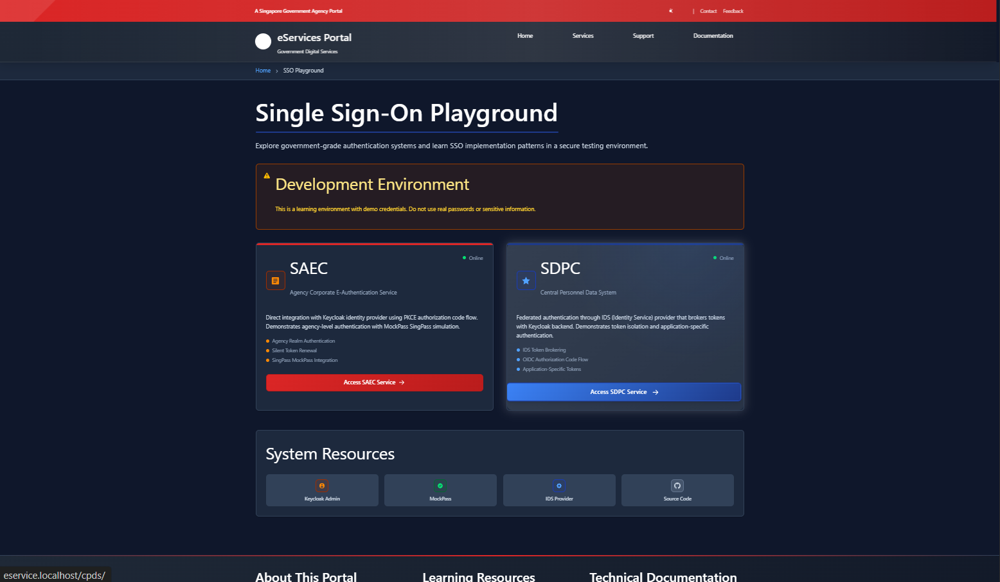
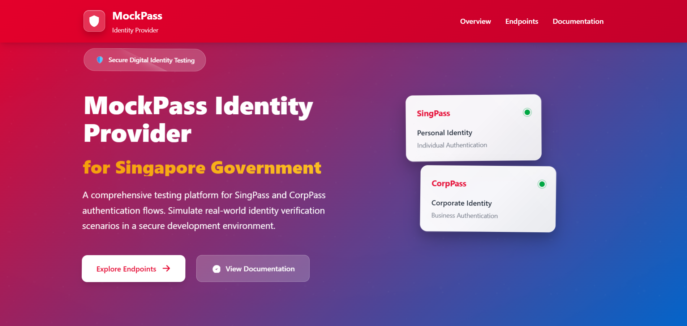

# SSO Application Stack

A learning playground for single sign-on (SSO) patterns built with Docker, featuring Keycloak, MockPass OIDC provider, MockSAML provider, and multiple microservices. This project is designed for experimentation and understanding authentication flows in a local development environment.

[](https://www.docker.com/)
[](https://www.keycloak.org/)
[](https://nodejs.org/)
[](https://nginx.org/)
[](https://www.postgresql.org/)
[](https://github.com/kristophjunge/test-saml-idp)

## 📸 Screenshots

### 🏠 Main Portal Dashboard
The Singapore government-styled eServices portal provides access to both ACEAS and CPDS applications with professional branding and modern UI.



### 🔐 ACEAS Application 
Direct Keycloak authentication with Authorization Code + PKCE flow, featuring real-time authentication status and token management.


### 📊 CPDS Application
Federated authentication through IDS provider that brokers tokens with Keycloak backend, demonstrating token isolation patterns.


### 🔑 Keycloak Login Page
Comprehensive identity management with agency realm configuration, user management, and authentication flow monitoring.


### 🎭 MockPass Authentication
Singapore SingPass simulation providing realistic government authentication experience for testing and development.




### 🟣 MockSAML Authentication
Test SAML Identity Provider for simulating SAML-based authentication flows.


### 🚨 Error Pages
Professional error handling with government-styled 404 and 50x pages featuring animations and auto-refresh functionality.


## 📖 Table of Contents

- [🏗️ Architecture](#️-architecture)
- [🚀 Quick Start](#-quick-start)
- [🛠️ Development Commands](#️-development-commands)
- [📁 Project Structure](#-project-structure)
- [🔄 Authentication Flow](#-authentication-flow)
- [🐳 Docker Configuration](#-docker-configuration)
- [🔧 Configuration](#-configuration)
- [🔍 API Documentation](#-api-documentation)
- [🚨 Troubleshooting](#-troubleshooting)
- [⚡ Performance Tuning](#-performance-tuning)
- [🧹 Maintenance](#-maintenance)
- [🔒 Security Features](#-security-features)
- [🚀 Deployment](#-deployment)
- [📚 Additional Resources](#-additional-resources)

## 🏗️ Architecture

The stack consists of containerized services orchestrated with Docker Compose:

### Core Services
- **🔐 Keycloak** – Identity provider with custom SPIs and agency realm configuration
- **🎭 MockPass** – Singapore government authentication simulator (SingPass/CorpPass)
- **🟣 MockSAML** – Test SAML Identity Provider for SAML authentication flows
- **🔍 IDS** – Node.js OpenID Connect provider for token brokering
- **🌐 Nginx** – High-performance reverse proxy with SSL/TLS support
- **🗃️ PostgreSQL** – Keycloak database with optimized performance settings

### Application Services  
- **📱 ACEAS API** – Sample microservice with Keycloak integration
- **📊 CPDS API** – Sample microservice with IDS token validation
- **🖥️ Web Frontend** – Single-page applications served by Nginx

### Infrastructure Features
- 🔒 **SSL/TLS Support** – Self-signed certificates for development
- 📊 **Health Checks** – Comprehensive service monitoring
- 🎯 **Resource Limits** – Memory and CPU constraints for stability
- 🔄 **Hot Reload** – Development-friendly file watching
- 📝 **Centralized Logging** – Background log collection and viewing

## 🚀 Quick Start

### Prerequisites
- [Docker](https://docs.docker.com/get-docker/) and Docker Compose V2
- [Make](https://www.gnu.org/software/make/) (for convenience commands)
- **Host file configuration** (see setup below)

### Host File Configuration

For the application to work correctly, you need to add entries to your system's hosts file to point the required domains to localhost.

#### 🪟 Windows
1. **Open Command Prompt as Administrator**
   - Press `Win + R`, type `cmd`, then press `Ctrl + Shift + Enter`

2. **Edit the hosts file**
   ```cmd
   notepad C:\Windows\System32\drivers\etc\hosts
   ```

3. **Add these lines at the end of the file**
   ```
   127.0.0.1 eservice.localhost
   127.0.0.1 mockpass.localhost
   127.0.0.1 mocksaml.localhost
   ```

4. **Save and close the file**

#### 🍎 macOS
1. **Open Terminal**

2. **Edit the hosts file with your preferred editor**
   ```bash
   sudo nano /etc/hosts
   ```
   Or with vim:
   ```bash
   sudo vim /etc/hosts
   ```

3. **Add these lines at the end of the file**
   ```
   127.0.0.1 eservice.localhost
   127.0.0.1 mockpass.localhost
   127.0.0.1 mocksaml.localhost
   ```

4. **Save and exit**
   - For nano: `Ctrl + X`, then `Y`, then `Enter`
   - For vim: `:wq` then `Enter`

5. **Flush DNS cache**
   ```bash
   sudo dscacheutil -flushcache
   sudo killall -HUP mDNSResponder
   ```

#### 🐧 Linux
1. **Open Terminal**

2. **Edit the hosts file**
   ```bash
   sudo nano /etc/hosts
   ```
   Or with your preferred editor:
   ```bash
   sudo vim /etc/hosts
   ```

3. **Add these lines at the end of the file**
   ```
   127.0.0.1 eservice.localhost
   127.0.0.1 mockpass.localhost
   127.0.0.1 mocksaml.localhost
   ```

4. **Save and exit**
   - For nano: `Ctrl + X`, then `Y`, then `Enter`
   - For vim: `:wq` then `Enter`

5. **Flush DNS cache** (varies by distribution)
   ```bash
   # Ubuntu/Debian
   sudo systemctl restart systemd-resolved
   
   # CentOS/RHEL/Fedora
   sudo systemctl restart NetworkManager
   
   # Or manually flush
   sudo systemctl flush-dns
   ```

#### ✅ Verify Configuration
After updating your hosts file, verify the configuration works:

